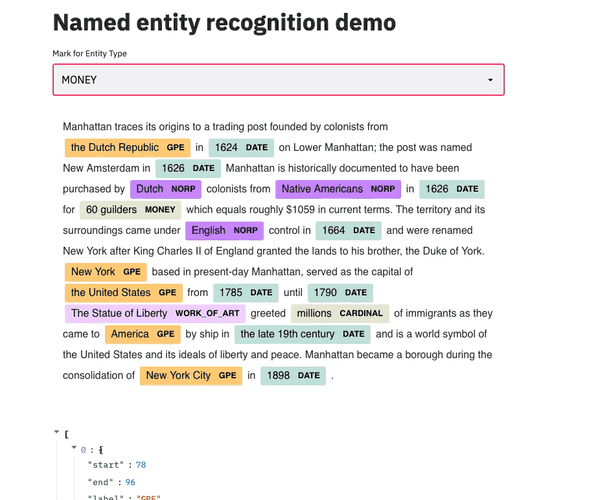

## Streamlit Named Entity Recognition (NER) Annotation component

This is a component to assist with the annotation of *named entities* in an unstructured piece of text. The concept for this is borrowed from what is offered by [Prodi.gy](https://prodi.gy/). This code is derived from the work done by [andfalino](https://github.com/andfanilo) in his excellent [streamlit-named-entity-svelte](https://github.com/andfanilo/streamlit-named-entity-svelte) repository. 

The functionality has been expanded to allow for selecting of new entities and uses the [streamlit-component-svelte-template](https://github.com/93degree/streamlit-component-svelte-template).

I am also using this component as a testbed to get familiar with streamlit custom components and svelte. 

**NOTE** This is a work in progress
### Development 

  - Backend
    + Install [Poetry](https://python-poetry.org/)
    + Run `poetry install`
    + Drop into a virtualenv shell `poetry shell`
    + Install a spacy model `python -m spacy download en_core_web_sm`
    + Edit `st_ner_annotate/__init__.py` change `_RELEASE` to `False` 
    + Run `streamlit run st_ner_annotate/__init__.py`
  - Frontend
    + `cd st_codemirror_diff/frontend`
    + `npm install`
    + `npm run dev`
  - Now the frontend and backend should be up, the page can be accessed at `http://localhost:8501`

### Development - Release
  - Frontend
    + Run `npm run build` in `st_ner_annotate/frontend`
  - Backend
    + Edit `st_ner_annotate/__init__.py` change `_RELEASE` to `True`
    + Drop into python virtualenv by running `poetry shell`
    + Build python dist wheels `python setup.py sdist bdist_wheel`
    + This will create the python `st_ner_annotate-<version>-py3-none-any.whl` in the `dist` dir
    + Now install this via `python -m pip install <path-to-st_ner_annotate.whl>`
### Demo

### References
1. [Prodi.gy](https://prodi.gy/)
2. [streamlit-named-entity-svelte](https://github.com/andfanilo/streamlit-named-entity-svelte)
3. [streamlit-component-svelte-template](https://github.com/93degree/streamlit-component-svelte-template) 
4. Text sample in demo taken from wiki entry on [Manhattan](https://en.wikipedia.org/wiki/Manhattan)
